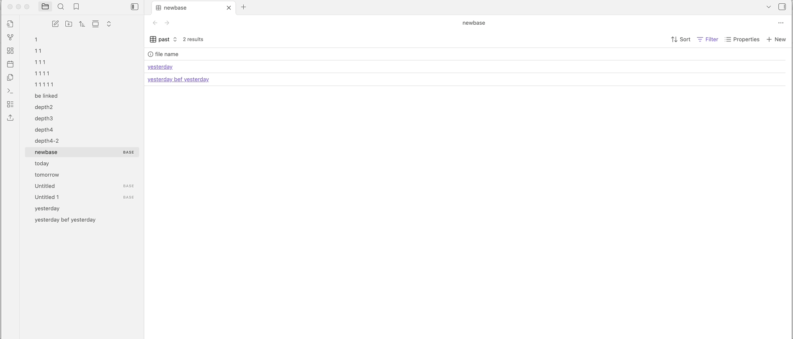

# Obsidian Export-Bases-Files Plugin

[简体中文](./README_zh.md) | English

**Export-Bases-Files** is an Obsidian plugin designed to bridge the gap between Obsidian's powerful internal **Bases** feature and your external file system. It allows you to export a specific set of files—filtered by your Bases Table Views—to any folder on your computer with just a few clicks.

## 🚀 Installation

As this plugin is not yet available in the official Obsidian Community Plugins gallery, you can install it using the **BRAT** plugin or manually.

### Via BRAT (Recommended)
1. Install the [Obsidian 42 - BRAT](https://github.com/TfTHacker/obsidian42-brat) plugin from the Community Plugins gallery.
2. Open **Settings** > **BRAT** > **Add Beta plugin**.
3. Paste the URL of this repository: `https://github.com/ljklonepiece/obsidian-export-files-by-bases`
4. Click **Add Plugin**.
5. Enable **Export-Bases-Files** in **Settings** > **Community Plugins**.

### Manual Installation
1. Download the latest `main.js`, `manifest.json`, and `styles.css` from the [Releases](https://github.com/ljklonepiece/obsidian-export-files-by-bases/releases) page.
2. Create a folder named `obsidian-export-by-bases-plugin` inside your vault's `.obsidian/plugins/` directory.
3. Move the downloaded files into that folder.
4. Reload Obsidian and enable the plugin in **Settings** > **Community Plugins**.

## 📖 How to Use

1. **Open the Interface**: Click the **Upload/Export** icon in the ribbon or use the command palette (`Cmd/Ctrl + P`) and search for `Export-Bases-Files: Open Export Interface`.
2. **Select your Base**: Choose the `.base` file that contains the data you want to export.
3. **Select your View**: Pick the specific Table View that has the filters you want to apply. 
4. **Choose Destination**: Click **Browse...** to select where on your computer you want the files to go.
5. **Optional Settings**: You can choose to include or exclude specific file types:
    - **Include Internal Files**: Toggling this on will include Obsidian-specific files like `.base` and `.canvas` if they are linked.
    - **Include Media Files**: Toggling this on will include images, audio, video, and archive files found in your export scope.
6. **Export**: Hit the **Export** button. A notice will appear once the process is complete!

## For Developers

If you want to build the plugin from source:
1. Clone the repository.
2. Run `npm install`.
3. Run `npm run build` to generate the `main.js`.
4. Run `npm test` to verify the logic with our unit test suite.

## Support

If you find this plugin helpful, you can support my work:

中国用户：

If you encounter any issues or have feature requests, please open an issue on the [GitHub repository](https://github.com/ljklonepiece/obsidian-export-files-by-bases/issues).
